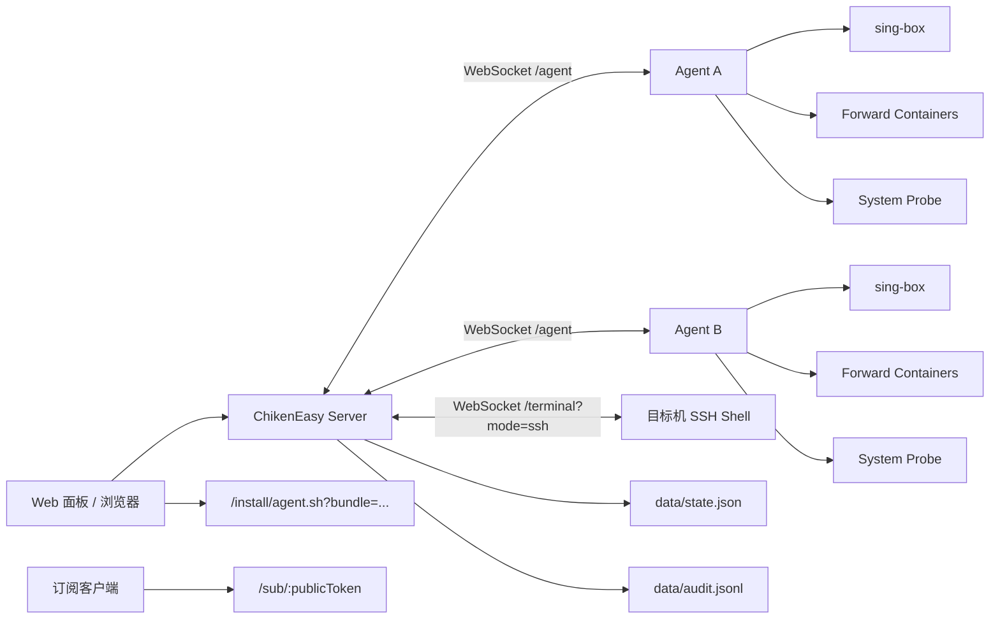

# 架构说明

本文档描述 `main` 分支在 **2026-05-14** 的已落地架构。

## 1. 角色划分

### 主控 Server

主控负责：

- 提供 Web 面板和 REST API
- 接收 Agent 长连接并下发命令
- 保存 Agent 元数据、配置版本、SSH 凭据、转发规则、订阅配置、API Token 和安装 bundle
- 提供日志 SSE、终端 WebSocket、公开订阅链接和审计日志
- 在真实 SSH、Agent 执行和远程部署之间做路由选择

### Agent

Agent 只接受主控命令，主要动作包括：

- `service`: start / stop / restart / status
- `read_config`: 读取当前 `sing-box` 配置
- `apply_config`: 写入配置、校验、失败回滚、成功后按需重启
- `tail_logs`: 读取日志
- `exec`: 执行命令
- `apply_forward_rule`: 创建或更新独立转发容器
- `remove_forward_rule`: 删除独立转发容器
- `uninstall_agent`: 卸载 Agent
- `heartbeat`: 持续上报 sing-box 状态和探针数据

### Web 面板

前端负责：

- 展示服务器状态、节点配置、订阅聚合、转发规则和审计日志
- 管理 API Token
- 进入真实 WebSSH 终端
- 生成或执行一键部署命令
- 展示实时探针卡片和趋势图

## 2. 鉴权与接入链路

### Agent 接入

- Agent 通过 `/agent` WebSocket 向主控发起连接
- 首条消息为 `hello`，携带接入 token、机器信息和首个探针快照
- 主控校验通过后建立在线状态，并接收心跳、日志和命令结果

### API Token

API Token 是主控级别的访问凭据：

- 可放在 `Authorization: Bearer ck_xxx`
- 也可放在 `?token=ck_xxx`

同一套校验逻辑会应用到：

- REST API
- 日志 SSE
- `/terminal` WebSocket

如果启用 `CHIKEN_REQUIRE_API_TOKEN=1`，则除 `/api/health` 外都必须带合法 token。

### 安装 Bundle

一键部署不复用 API Token，而是走独立短时效 bundle：

1. 面板先请求 `POST /api/agents/:id/install-command`
2. 主控生成一次性 Agent 接入 token 和短期安装 bundle
3. 浏览器得到可执行的 `curl | bash`
4. 或者主控直接通过 SSH 把同一份脚本推到远端 `sh -s`

## 3. WebSSH 架构

终端入口统一走 `/terminal` WebSocket，但底层有两种模式：

- `mode=ssh`
- `mode=agent`

真实 SSH 模式：

- 主控从 `state.json` 读取目标 Agent 的 SSH profile
- 使用 `ssh2` 直接连接目标机
- 建立真实 shell，会话输入输出通过 WebSocket 透传
- 前端使用 `xterm.js` 渲染并同步窗口大小

兼容 Agent 模式：

- 当 SSH 凭据未配置，或用户主动切换到兼容模式时启用
- 面板按行把命令发给 Agent 执行
- 更适合临时跑命令，不适合作为完整运维终端

## 4. 配置下发链路

节点向导和原始 JSON 下发最终都走同一套 Agent 能力：

1. 前端提交配置或向导表单
2. Server 生成或接收最终 `sing-box` JSON
3. Server 记录配置版本，并在向导模式下同步更新 `nodeProfiles`
4. Server 下发 `apply_config`
5. Agent 备份旧配置
6. Agent 自动补齐缺失的 TLS 证书
7. Agent 运行 `sing-box check`
8. 成功则按需重启，失败则回滚旧配置
9. Agent 把结果和日志回传给主控

当前自动补齐证书只针对：

- `Trojan + TLS`
- `Hysteria2`

## 5. 订阅聚合架构

订阅模块由 `server/subscriptions.js` 驱动。

核心思想：

- 本地节点不从最终 `sing-box` JSON 反推
- 而是在节点向导下发时额外保存一份可导出的 `nodeProfiles`
- 订阅页再基于 `nodeProfiles + 外部原始内容` 进行聚合

支持的数据源：

- 本地主控下发过的节点
- 外部 URI 列表
- 外部 Base64 订阅正文
- 外部 Clash YAML 中的 `proxies:` 段

支持的输出：

- 公开订阅链接 `GET /sub/:publicToken`
- 内置 Clash 模板切换

当前内置模板：

- `Clash Rule Basic`
- `Clash Global`
- `Clash Fallback`

## 6. 探针架构

实时探针由 Agent 内建完成，不依赖额外监控组件。

采集内容：

- CPU 使用率与负载
- 内存与 Swap
- 根分区磁盘
- 网络上下行速率
- 累计流量
- 运行时长

工作方式：

- Agent 固定间隔采集并在 `heartbeat` 中上报
- Server 把最新数据挂到 `agent.metrics`
- Server 额外保留一段 `metricsHistory`
- 前端轮询 `/api/dashboard` 和 `/api/agents/:id` 展示卡片与趋势图

Docker 模式下：

- Agent 通过 `/:/hostfs:ro`
- 再配合 `CHIKEN_HOST_ROOT=/hostfs`
- 读取宿主机视角的系统指标

## 7. 转发架构

端口转发已经从“覆盖主配置”改为“独立容器”模型。

支持引擎：

- `sing-box`
- `Realm`
- `GOST`

工作方式：

- Server 根据规则生成标准化转发计划
- Agent 把计划写入 `forwarders/<rule-id>/...`
- Agent 用 `docker run -d` 启动独立容器
- 容器命名固定为 `chiken-forward-<rule-id>`
- 删除规则时，Agent 会删除容器并清理目录

因此：

- 主 `sing-box` 和转发容器互不覆盖
- 每条转发规则可独立启停和替换
- 转发能力要求 Agent 运行在 Docker 模式

## 8. 一键部署架构

一键部署分为两条路径：

### 手工命令路径

1. 前端请求 `install-command`
2. Server 生成 bundle 与命令
3. 用户拿到 `curl | bash`
4. 远端机器执行安装脚本并连回主控

### 面板直推路径

1. 前端请求 `deploy`
2. Server 生成同样的 bundle
3. Server 通过 SSH 对目标机执行 `sh -s`
4. 远端机器完成安装并启动 Agent

支持两种落地形态：

- `service`: systemd + Node.js
- `docker`: Docker Compose

## 9. 数据持久化

主控侧：

- `data/state.json`
  - `tokens`
  - `apiTokens`
  - `agents`
  - `configVersions`
  - `forwardRules`
  - `nodeProfiles`
  - `subscriptionProfiles`
  - `sshProfiles`
  - `installBundles`

- `data/audit.jsonl`
  - 记录配置、SSH、部署、订阅、转发和接入相关事件

Agent 侧：

- `agent-state/agent.json`
- `/etc/sing-box/config.json`
- `/etc/sing-box/chiken-backups`
- `forwarders/<rule-id>/...`

## 10. 当前实现要点

- “服务器列表点一下就进 SSH”已经是正式能力
- SSH 页面同时承担终端、SSH 配置和一键部署入口
- API Token 可以直接进入并控制主控，必须按管理权限对待
- `Realm / GOST` 转发和主节点配置是并列能力，不再是覆盖式配置
- 订阅聚合当前优先保证“可稳定导出本地节点 + 可吸收外部原始内容”，而不是完全复刻外部模板生态
