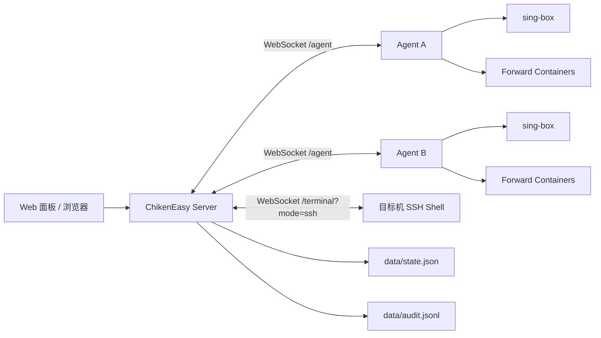

# 架构说明

本文档描述当前 `main` 分支已经落地的系统架构。

## 1. 角色划分

### 主控 Server

主控负责：

- 提供 Web 面板和 REST API
- 接收 Agent 长连接并下发命令
- 保存 Agent 元数据、配置版本、SSH 凭据、转发规则、API Token
- 提供日志 SSE、终端 WebSocket、审计日志
- 在直接 SSH 和 Agent 执行之间做路由选择

### Agent

Agent 只接受主控命令，主要动作包括：

- `service`: start / stop / restart / status
- `read_config`: 读取当前 `sing-box` 配置
- `apply_config`: 写入配置、校验、失败回滚、成功后按需重启
- `tail_logs`: 读取服务日志
- `exec`: 执行单条命令
- `apply_forward_rule`: 创建或更新独立转发容器
- `remove_forward_rule`: 删除独立转发容器
- `uninstall_agent`: 卸载 Agent

### Web 面板

前端页面负责：

- 展示服务器状态、节点配置、转发规则、审计日志
- 管理 API Token
- 保存当前浏览器会话使用的 token
- 在切换节点协议时，自动切换为该协议对应的表单和默认值
- 从服务器列表或详情页直接打开 SSH 页面

## 2. 鉴权与接入链路

### Agent 接入

- Agent 通过 `/agent` WebSocket 向主控发起连接。
- 首条消息为 `hello`，携带接入 token 和机器信息。
- 主控校验成功后建立在线状态，并开始接收心跳、日志和命令结果。

### API Token

API Token 是主控级别的访问凭据：

- 可以放在 `Authorization: Bearer ck_xxx`
- 也可以放在 `?token=ck_xxx`

主控会把同一套校验逻辑应用到：

- REST API
- 日志 SSE
- `/terminal` WebSocket

如果设置 `CHIKEN_REQUIRE_API_TOKEN=1`，除 `/api/health` 外都必须带合法 token。

## 3. SSH 与终端架构

终端入口统一走 `/terminal` WebSocket，但底层有两种模式：

- `mode=ssh`
- `mode=agent`

真实 SSH 模式：

- 主控从 `state.json` 读取该 Agent 对应的 SSH profile
- 使用 `ssh2` 直接连到目标机
- 建立真实 shell，会话输入输出通过 WebSocket 透传

兼容 Agent 模式：

- 当 SSH 凭据未配置，或用户主动切换到兼容模式时使用
- 面板发送单条命令给 Agent 执行
- 更适合临时跑命令，不适合作为完整运维终端

因此当前推荐路径是：

- 安装和系统级运维优先用真实 SSH
- 快速执行命令可退回 Agent 模式

## 4. 配置下发链路

节点配置向导和原始 JSON 下发最终都会走同一套 Agent 能力：

1. 前端提交配置或向导表单
2. Server 生成或接收最终 `sing-box` JSON
3. Server 记录配置版本并下发 `apply_config`
4. Agent 备份旧配置
5. Agent 自动补齐缺失的 TLS 证书
6. Agent 运行 `sing-box check`
7. 校验成功则按需重启，失败则恢复旧配置
8. Agent 把结果和日志回传给主控

当前 TLS 自动补齐只针对：

- `Trojan + TLS`
- `Hysteria2`

前提是配置里启用了 TLS 且目标证书路径不存在。

## 5. 转发架构

端口转发已经从“覆盖主配置”改为“独立容器”模型。

支持的引擎：

- `sing-box`
- `Realm`
- `GOST`

工作方式：

- Server 根据规则生成标准化转发计划
- Agent 把计划写入 `forwarders/<rule-id>/...`
- Agent 以 `docker run -d` 启动独立容器
- 容器名固定为 `chiken-forward-<rule-id>`
- 删除规则时，Agent 会删除容器并清理对应目录

这意味着：

- 主 `sing-box` 和转发容器互不覆盖
- 每条转发规则可以独立启停和替换
- Agent 需要 Docker 模式才能启用转发能力

## 6. 数据持久化

主控侧：

- `data/state.json`
- `tokens`
- `apiTokens`
- `agents`
- `configVersions`
- `forwardRules`
- `sshProfiles`

- `data/audit.jsonl`
- 记录配置、SSH、服务控制、转发、接入等审计事件

Agent 侧：

- `agent-state/agent.json`
- `/etc/sing-box/config.json`
- `/etc/sing-box/chiken-backups`
- `forwarders/<rule-id>/...`

## 7. 当前实现要点

- “服务器列表点一下就进 SSH”已经是正式能力，不再依赖手工复制命令。
- 协议切换会自动替换字段和默认值，避免不同协议表单串味。
- API Token 可以直接进入并控制主控，所以必须按管理权限对待。
- `Realm` / `GOST` 转发和主节点配置是并列能力，不应再按旧文档理解为覆盖式配置。
