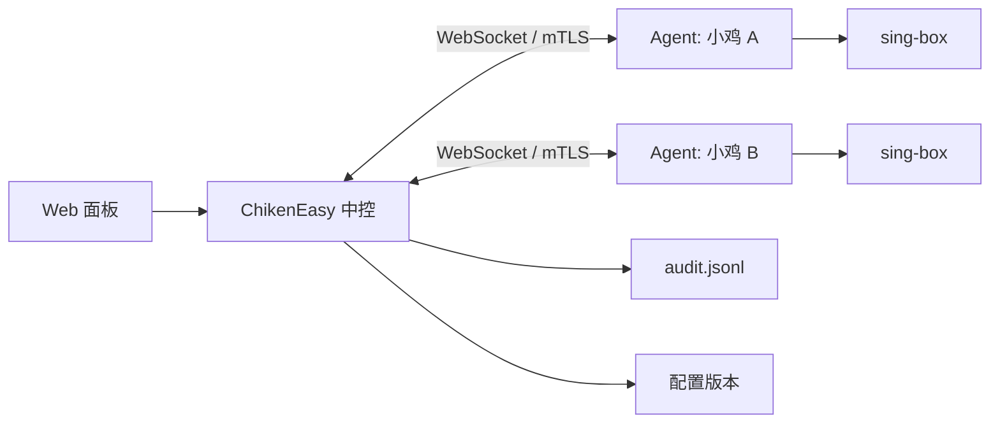

# 架构说明

## 中控

中控负责保存 Agent 元数据、接入 Token、配置版本和审计日志。面板通过 REST API 操作中控，中控再通过长连接给 Agent 下发命令。

## Agent

Agent 只接受中控命令，主要动作包括：

- `service`: start / stop / restart / status
- `read_config`: 读取当前 sing-box 配置
- `apply_config`: 写入配置、执行 `sing-box check`、按需重启
- `tail_logs`: 读取 systemd journal 日志
- `preset`: 执行中控预设命令

## 配置版本

每次从面板应用配置时，中控都会记录一个版本。Agent 写入新配置前，会把本机旧配置备份到 `/etc/sing-box/chiken-backups`。
